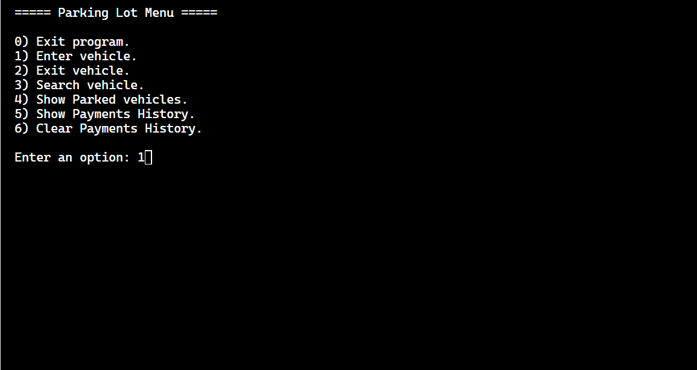
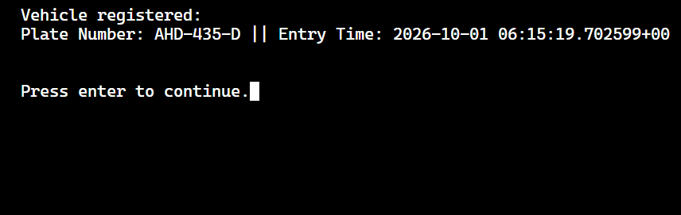
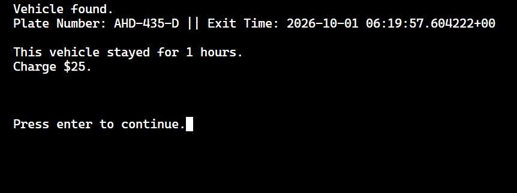
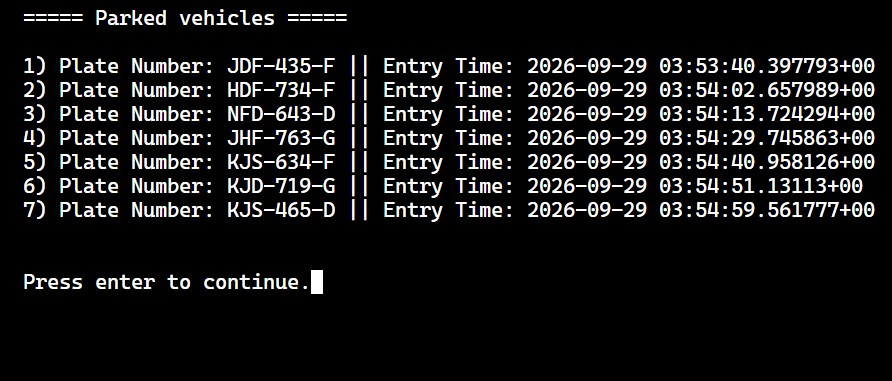

# Parking Lot Manager

C++20 console app that manages parking lot entries, exits and payments with persistent PostgreSQL storage.

## Features
- Register vehicles with validated license plates (ABC-123-A)
- Automatic entry/exit timestamps generated by PostgreSQL
- Billing with partial hours rounded up
- Payment history stored across runs
- Capacity limit and duplicate-plate prevention

## Tech Stack
C++20 · PostgreSQL (Neon) · libpqxx · MSYS2 g++ · Git

## Screenshots
| Vehicle entry | Vehicle exit and payment |
|---|---|
|  |  |

| Parked vehicles | Payment history |
|---|---|
|  |  |

## Quick Start
1. Install the requirements (see below)
2. Create the tables: run `schema.sql` on your database
3. Set the `NEON_DB_URL` environment variable
4. Build and run
(real commands here, matching how you actually build)

### Requirements
- MSYS2 (UCRT64) with g++ supporting C++20
- libpqxx and libpq
- A PostgreSQL database (a free Neon account works)

## How It Works
### Architecture
- `ParkingLot`: capacity, searches, exits
- `Vehicle`: vehicle data
- `Database`: queries and transactions
- `inputValidation`: menu and plate validation

### Database Design
- `vehicles`: cars currently parked
- `payments`: completed transactions
Exiting a vehicle inserts the payment and deletes the vehicle in **one transaction**.

## Technical Highlights
- Parameterized queries to prevent SQL injection
- Credentials loaded from an environment variable
- Server-side timestamps (no dependence on local clock)
- Exception handling for input, config and database errors

## Testing
(add once you have tests: how to run them, what they cover)

## Roadmap
- [ ] Unit tests
- [ ] CMake build
- [ ] SQLite mode for local demos
- [ ] Configurable capacity and rates
